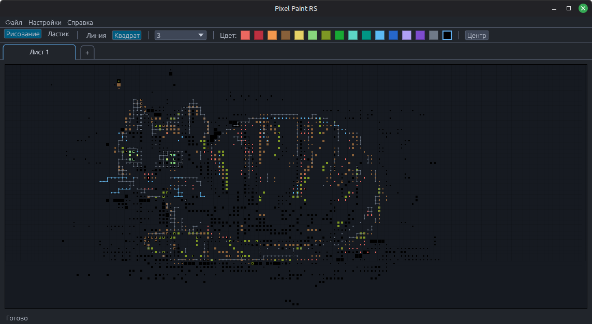

# Pixel Paint RS

Русский | [English](#english)

`Pixel Paint RS` — программа для рисования на сетке, простых схем, пиксельных рисунков и черновых набросков. Поддерживает вкладки, палитру, сохранение в `JSON` и экспорт в `PNG`.



## Что умеет

- рисование по сетке
- 2 примитива: линия и квадратная точка
- 4 размера кисти
- палитра цветов
- несколько вкладок в одном документе
- сохранение рисунков в `JSON`
- экспорт текущего видимого поля в `PNG`
- автосохранение и восстановление последней сессии
- локализация интерфейса

## Архитектура

- `src/app` — состояние приложения и runtime-настройки
- `src/domain` — модель документа, вкладок и штрихов
- `src/persistence` — сохранение `JSON` и session state
- `src/ui` — окно, холст, тулбар, вкладки и общий render core
- `docs/ARCHITECTURE.md` — архитектурные заметки

Экранный рендер и `PNG`-экспорт используют общий render core, чтобы поведение было согласованным.

## Формат хранения

- последняя сессия сохраняется локально автоматически

## Сборка

```bash
cargo build --release
```

Готовый бинарник:

```bash
target/release/pixel_paint_rs
```

## Запуск

```bash
cargo run
```

## Управление

- левая кнопка мыши — рисование
- средняя кнопка мыши — панорамирование
- колесо мыши / жест — масштаб
- двойной клик по вкладке — переименование
- `Ctrl+N` — новый документ
- `Ctrl+O` — открыть
- `Ctrl+S` — сохранить
- `Ctrl+Shift+S` — сохранить как
- `Ctrl+Z` — undo
- `Ctrl+Y` / `Ctrl+Shift+Z` — redo
- `Home` / `Ctrl+0` — центрировать вид

## Платформы

- Linux
- Windows

## Лицензия

Проект распространяется свободно с обязательным указанием автора и ссылкой на автора.

Подробности: `LICENSE`

---

## English

`Pixel Paint RS` is a desktop application for grid-based drawing, simple schemes, pixel drawings, and rough drafts. Includes tabs, palette, `JSON` save/load, and `PNG` export.


## Features

- grid-based drawing
- 2 primitives: line and square point
- 4 brush sizes
- color palette
- multiple tabs in one document
- `JSON` save/load
- `PNG` export of the current visible canvas
- autosave and last-session restore
- UI localization

## Architecture

- `src/app` — app state and runtime settings
- `src/domain` — document, tab, and stroke model
- `src/persistence` — `JSON` and session persistence
- `src/ui` — window layout, canvas, toolbar, tabs, and shared render core
- `docs/ARCHITECTURE.md` — architecture notes

The on-screen canvas renderer and `PNG` export share the same render core so both outputs stay consistent.

## Storage

- the last session is autosaved locally

## Build

```bash
cargo build --release
```

Binary:

```bash
target/release/pixel_paint_rs
```

## Run

```bash
cargo run
```

## Controls

- left mouse button — draw
- middle mouse button — pan
- mouse wheel / gesture — zoom
- double click on a tab — rename
- `Ctrl+N` — new document
- `Ctrl+O` — open
- `Ctrl+S` — save
- `Ctrl+Shift+S` — save as
- `Ctrl+Z` — undo
- `Ctrl+Y` / `Ctrl+Shift+Z` — redo
- `Home` / `Ctrl+0` — center view

## Platforms

- Linux
- Windows

## License

Free redistribution is allowed with mandatory author attribution and a link to the author.

See `LICENSE` for details.
